# Data Link Layer Flow Control: Stop-and-Wait, Go-Back-N, and Selective Repeat

> This file is generated. Do not edit `report.md` by hand: edit
> `report_template.md` and re-run `make -C C++ results`.

This report compares three Automatic Repeat reQuest (ARQ) protocols implemented
in C++17 over a simulated Data Link Layer. All numbers below come from
[`../results/experiments.csv`](../results/experiments.csv), which is produced by
`tools/run_experiments.py` and checked by `tools/validate_results.py` before any
figure or table in this report is rendered.

## 1. The protocols

All three protocols move a file across one bidirectional TCP connection that
acts only as a carrier. Loss, corruption, delay, acknowledgment, timeout,
duplicate detection, and retransmission are all simulated at the application
layer; TCP's own reliability is never allowed to stand in for them.

**Stop-and-Wait** keeps exactly one frame outstanding. The sender transmits a
frame and advances only when the matching acknowledgment arrives; on timeout it
retransmits the same frame. It is the simplest protocol and wastes the most time
waiting, but it never retransmits a frame that was already delivered.

**Go-Back-N** gives the sender a window of `N` frames and the receiver a window
of one. Acknowledgments are cumulative, so an acknowledgment for frame `k`
implicitly acknowledges everything before it. The receiver discards any frame
that arrives out of order. On timeout the sender retransmits every outstanding
frame from the window base, which is what makes a single lost frame expensive:
the whole window is resent behind it.

**Selective Repeat** gives both sender and receiver a window of `N`.
Acknowledgments are independent, the receiver buffers valid out-of-order frames
and delivers them only once they are contiguous, and the sender retransmits only
the frames that were actually not acknowledged. It costs receiver memory and
bookkeeping in exchange for retransmitting far less.

## 2. The wire contract

Every data frame carries a manually serialized 15-byte header, namely a 6-byte
source MAC address, a 6-byte destination MAC address, a 2-byte valid payload
length in network byte order, and a 1-byte sequence number, followed by the
padded payload and a Frame Check Sequence. No object's in-memory representation
is ever copied to the wire.

The length field records the *unpadded* payload length, so a short final chunk is
reconstructed exactly and zero padding is never written to the output file. A
complete simulated frame is between 64 and 1518 bytes; short frames are padded up
to the 64-byte minimum for transmission.

The FCS covers the serialized header and the complete padded payload, excluding
itself, and its size depends on the selected scheme: Checksum-16 (2 bytes), CRC-8
`0xD5` (1 byte), CRC-10 `0x233` (2 bytes), CRC-16 `0x8005` (2 bytes), and CRC-32
`0x04C11DB7` (4 bytes). The receiver verifies structure and FCS before it will
accept a frame; a frame that fails is discarded silently and is never
acknowledged, not even negatively.

Sequence numbers are one byte and wrap modulo 256, so Go-Back-N is limited to at
most 255 outstanding frames and Selective Repeat to `N <= 128`, which keeps a
wrapped sequence number unambiguous.

Each application record on the TCP stream carries an external two-byte
network-order length prefix. That prefix is transport framing: it is not part of
a simulated frame, is not covered by the FCS, and is never chosen for simulated
corruption, so a corrupted simulated header can never desynchronize the byte
stream.

## 3. Methodology

### 3.1 What was varied, and what was held fixed

The matrix contains **63 runs**: 3 unimpaired baseline runs, one per protocol, plus 3 protocols x 4 impairment paths x 5 probability levels (0.1, 0.2, 0.3, 0.4, 0.5). Every run transferred the whole input file byte for byte; the runner aborts the matrix if a reconstructed file differs from its input, so every row below describes a transfer that actually succeeded.

The experiment is a **one-factor-at-a-time** design. The evaluation guideline
asks for all three protocols with no impairment and with probabilities 0.1
through 0.5 for errors and for delays, independently affecting the DATA and ACK
paths. Each run therefore holds three of the four impairment probabilities at
zero and sweeps the fourth. A full cross product of four dimensions at five
levels would be 625 combinations per protocol and would confound the paths with
one another; sweeping them independently is what isolates each path's effect,
which is the comparison the guideline is asking for.

Everything not being varied is pinned so that the columns are comparable:

| Parameter | Value | Why |
| --- | --- | --- |
| Input file | `test_data/input.bin`, 4096 bytes | Deterministic fixture; 4096 is not a multiple of 46, so the final frame is short and the short-final-frame path is exercised. |
| FCS scheme | `crc16` | CRC-16 (`0x8005`) has a 2-byte FCS and far stronger burst detection than Checksum-16 or CRC-8/10, without CRC-32's 4-byte overhead skewing the efficiency ratio. The end-to-end suite separately proves every protocol is byte-exact under all five schemes. |
| Payload size | 46 bytes | Safe for every FCS scheme and the professor's suggested size; it splits the input into 90 frames. |
| Window size | Stop-and-Wait 1, Go-Back-N 8, Selective Repeat 8 | Inside both protocol limits (Go-Back-N <= 255, Selective Repeat <= 128) and small relative to the 90-frame transfer, so the window fills and drains many times. Stop-and-Wait is one outstanding frame by definition and the sender forces its window to 1. |
| Seed | `20260831` | One seed for every run, so each protocol meets the same channel decision sequence. Frame selection and error-position selection are seeded independently inside the channel. |

### 3.2 How loss is modelled

The sender exposes one *error* probability and one *excessive delay* probability
per path. There is no separate drop probability, because excessive delay is how
this system models loss: a frame or acknowledgment that is delayed never arrives
before its timeout expires, so it is suppressed for that round and the sender
must recover exactly as it would from a loss. The `data-delay` and `ack-delay`
sweeps are therefore the loss sweeps, and the `data-error` and `ack-error` sweeps
are the bit-corruption sweeps.

### 3.3 Efficiency, defined before it is interpreted

> efficiency = unique_payload_bytes / transmitted_frame_bytes: the unique application payload the receiver accepted and delivered, divided by every DATA-frame byte the sender put on the wire, including retransmissions, the 15-byte header, zero padding, and the FCS. It is a dimensionless ratio in (0, 1]; 1.0 would mean every transmitted byte was useful payload delivered exactly once. ACK traffic is not counted, because the sender measures only what it transmits on the DATA path.

This is the definition used by `flow_control::Metrics::efficiency()` in
`src/metrics.cpp`, by `tools/validate_results.py`, by every efficiency figure,
and by every efficiency number in this report. It is stated once, in
`EFFICIENCY_DEFINITION`, and imported everywhere else.

Note that the baseline efficiency is bounded well below 1.0 by framing overhead
alone. With a 46-byte payload the frame is padded to the 64-byte minimum, so a
transfer with no retransmission at all can reach at most 46/64 = 0.71875.

### 3.4 Completion time, defined before it is interpreted

`completion_ms` is the simulation's logical clock: the sum of every round's
measured duration, each floored at a minimum of 1 ms, plus -- for every round
in which no progress was made -- the *current* value of the adaptive timeout
estimator at that point in the run. That estimator
(`include/timer.hpp`/`src/timer.cpp`) starts at a 100 ms constructor default
and adapts as RTT samples arrive, but Karn's rule discards the RTT sample of
any frame that was retransmitted, so a run that times out on every
progress-bearing frame never collects a sample and pays every one of its
timeout rounds at the unadapted 100 ms default rather than a value the
estimator ever fitted to this run's channel.

The estimator's value at any point in a run is therefore a separate,
data-dependent quantity driven by that run's own RTT samples, not a fixed
simulation parameter like the payload size or window. A large jump in
`completion_ms` between two runs can reflect a change in this estimator floor
as much as a change in retransmission count, so it should not be read as
protocol cost alone without checking `current_timeout_ms` and
`rtt_sample_count` for the runs being compared. §3.5 explains how a run with
zero RTT samples is detected and disclosed; the same runs are called out again
in §4.3 wherever their completion time or goodput is discussed.

### 3.5 Validation before interpretation

`tools/validate_results.py` runs before any figure or table is produced and fails
the whole pipeline, naming the offending run, if any of the following does not
hold:

- the delivered unique payload equals the input file size;
- `original_transmissions` equals the number of frames the input requires,
  `ceil(input_bytes / payload_bytes)`;
- every counter is a non-negative integer;
- `transmitted_frame_bytes` equals the total number of transmissions times the
  serialized wire size of one frame;
- `duplicates` does not exceed `acks`, and `out_of_order` does not exceed the
  acknowledgments that actually moved the window;
- an unimpaired run reports no retransmission, timeout, or duplicate;
- `completion_ms`, `transmitted_frame_bytes`, and `current_timeout_ms` are all
  strictly positive, so no derived value is ever computed over a zero
  denominator; and
- `efficiency`, `goodput_bytes_per_second`, and `mean_rtt_ms` each agree with
  their own definitions to within the six decimals the sender prints.

Matrix completeness is checked too: every protocol must have a baseline run and
all five probability levels on all four impairment paths, no run may appear
twice, and the fixed parameters must genuinely be constant across the runs being
compared.

A run whose `rtt_sample_count` is zero is a special case. Karn's rule discards
the RTT sample of any frame that was retransmitted, so under heavy DATA-path
impairment Go-Back-N can finish without a single unambiguous sample. Its
`mean_rtt_ms` denominator is zero and the mean is *not measurable*. Such runs are
flagged and excluded from RTT interpretation rather than being read as 0 ms.

In this result set 4 run(s) produced no unambiguous RTT sample at all, so their mean RTT is **not measurable** and is excluded from RTT interpretation:

- `go-back-n__data-error__0.4`
- `go-back-n__data-error__0.5`
- `go-back-n__data-delay__0.4`
- `go-back-n__data-delay__0.5`

### 3.6 Test strategy for the tooling

The validation, plotting, and report tooling was written test-first against a
small synthetic result set whose values are known exactly:

- `tests/test_generate_test_data.py` requires the fixture generator to be a pure
  function of its seed and size, to reproduce the committed
  `test_data/input.bin` byte for byte, and to reject invalid command lines
  without writing a partial file.
- `tests/test_run_experiments.py` covers what is unit-testable in the runner
  without mocking real subprocesses: matrix completeness for 0.1 to 0.5, the
  one-factor-at-a-time invariant, the fixed parameters, the protocol window
  limits, the sender command line, and metrics-row parsing and rejection. The
  subprocess orchestration itself is exercised for real by
  `make -C C++ experiments`.
- `tests/test_validate_results.py` mutates one field of one run at a time and
  requires the validator to reject the file and name the run. A validator that
  cannot fail would be worthless, so the mutations are the real test.
- `tests/test_plot_results.py` parses every generated figure as XML and compares
  each plotted marker against the value it claims to represent.
- `tests/test_generate_report.py` requires the rendered report to substitute
  every placeholder, to reference its evidence by relative path only, to contain
  no machine-specific absolute path, and to render identically twice.

## 4. Results

### 4.1 Unimpaired baseline

| Protocol | Completion (ms) | Goodput (B/s) | Efficiency | Original transmissions | Retransmissions | ACKs | Mean RTT (ms) |
| --- | --- | --- | --- | --- | --- | --- | --- |
| Stop-and-Wait | 91 | 45,011 | 0.711111 | 90 | 0 | 90 | 1.000000 |
| Go-Back-N | 13 | 315,077 | 0.711111 | 90 | 0 | 90 | 1.000000 |
| Selective Repeat | 13 | 315,077 | 0.711111 | 90 | 0 | 90 | 1.000000 |

With no impairment every protocol delivers the file with zero retransmissions and zero timeouts, and all three reach the same efficiency, because efficiency then measures nothing but framing overhead. What separates them is completion time: the two windowed protocols keep several frames in flight per round, while Stop-and-Wait pays a full round trip for every single frame.

### 4.2 Figures

Where two protocols' curves coincide exactly (see §4.3), the figures separate them by dash pattern and marker shape rather than by colour alone, so an overlapping pair stays distinguishable rather than collapsing into what looks like a single series.

#### DATA-path bit corruption

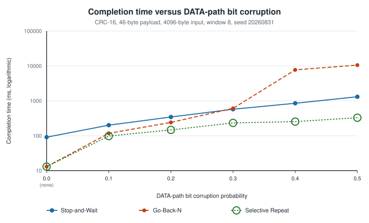

*Completion time versus DATA-path bit corruption. Source: [`completion_ms_vs_probability_data-error.svg`](../results/plots/completion_ms_vs_probability_data-error.svg).*

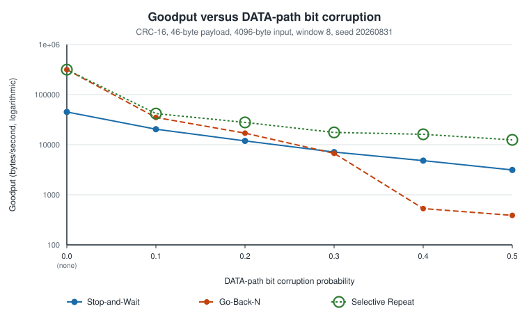

*Goodput versus DATA-path bit corruption. Source: [`goodput_bytes_per_second_vs_probability_data-error.svg`](../results/plots/goodput_bytes_per_second_vs_probability_data-error.svg).*

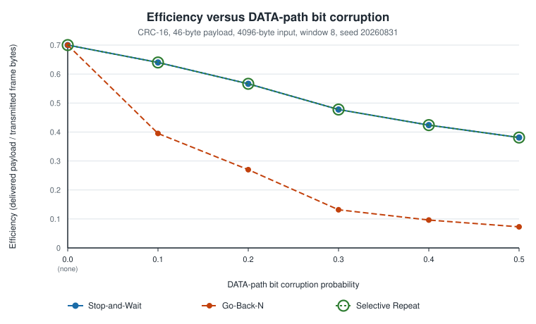

*Efficiency versus DATA-path bit corruption. Source: [`efficiency_vs_probability_data-error.svg`](../results/plots/efficiency_vs_probability_data-error.svg).*

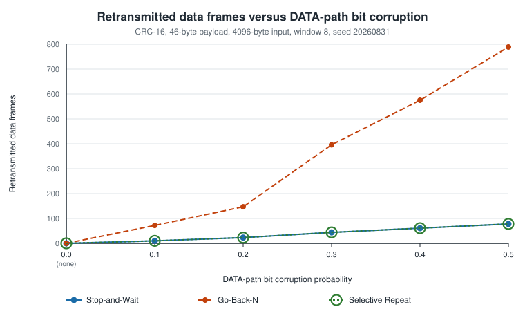

*Retransmitted data frames versus DATA-path bit corruption. Source: [`retransmissions_vs_probability_data-error.svg`](../results/plots/retransmissions_vs_probability_data-error.svg).*

#### DATA-path excessive delay (loss)

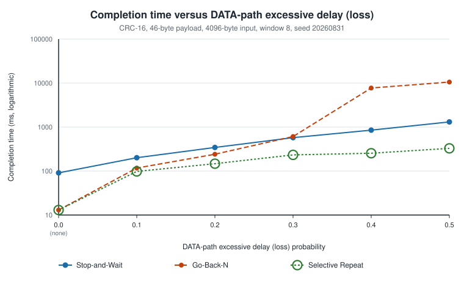

*Completion time versus DATA-path excessive delay (loss). Source: [`completion_ms_vs_probability_data-delay.svg`](../results/plots/completion_ms_vs_probability_data-delay.svg).*

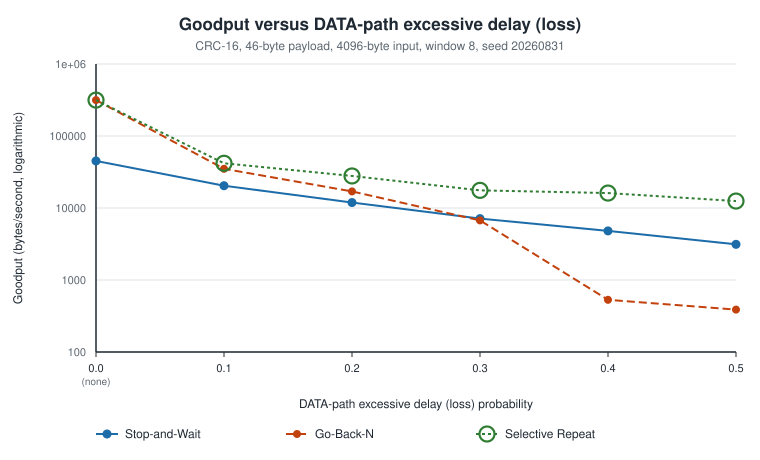

*Goodput versus DATA-path excessive delay (loss). Source: [`goodput_bytes_per_second_vs_probability_data-delay.svg`](../results/plots/goodput_bytes_per_second_vs_probability_data-delay.svg).*

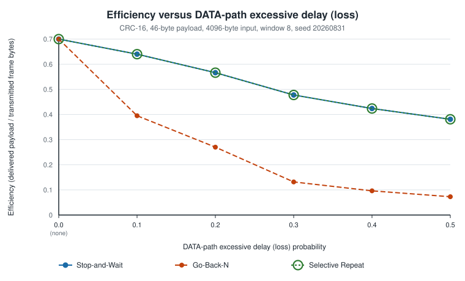

*Efficiency versus DATA-path excessive delay (loss). Source: [`efficiency_vs_probability_data-delay.svg`](../results/plots/efficiency_vs_probability_data-delay.svg).*

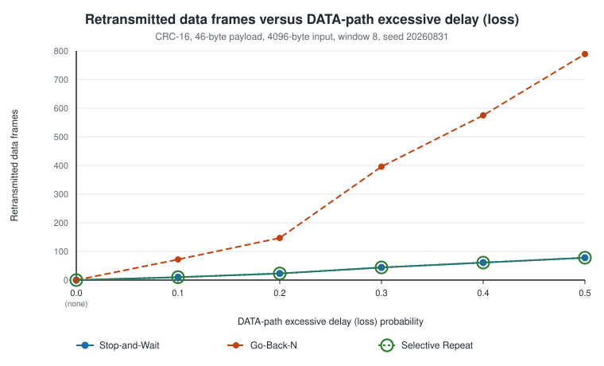

*Retransmitted data frames versus DATA-path excessive delay (loss). Source: [`retransmissions_vs_probability_data-delay.svg`](../results/plots/retransmissions_vs_probability_data-delay.svg).*

#### ACK-path bit corruption

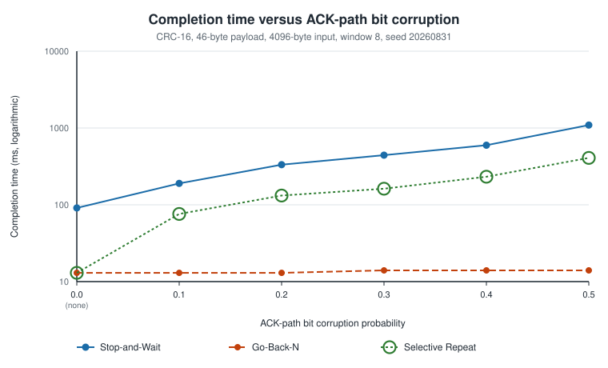

*Completion time versus ACK-path bit corruption. Source: [`completion_ms_vs_probability_ack-error.svg`](../results/plots/completion_ms_vs_probability_ack-error.svg).*

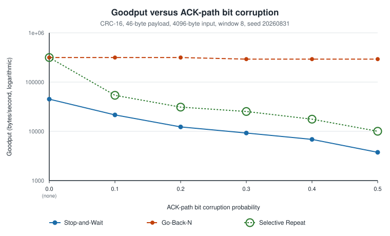

*Goodput versus ACK-path bit corruption. Source: [`goodput_bytes_per_second_vs_probability_ack-error.svg`](../results/plots/goodput_bytes_per_second_vs_probability_ack-error.svg).*

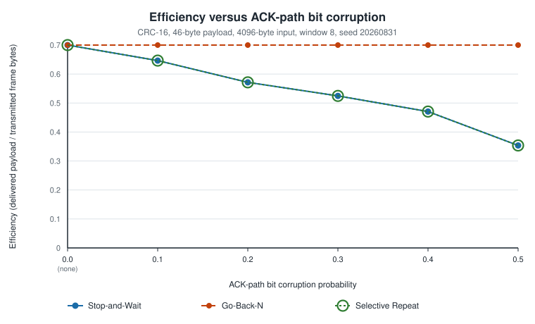

*Efficiency versus ACK-path bit corruption. Source: [`efficiency_vs_probability_ack-error.svg`](../results/plots/efficiency_vs_probability_ack-error.svg).*

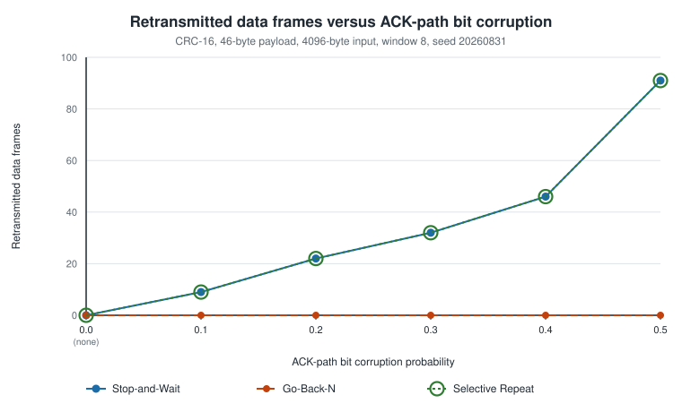

*Retransmitted data frames versus ACK-path bit corruption. Source: [`retransmissions_vs_probability_ack-error.svg`](../results/plots/retransmissions_vs_probability_ack-error.svg).*

#### ACK-path excessive delay (loss)

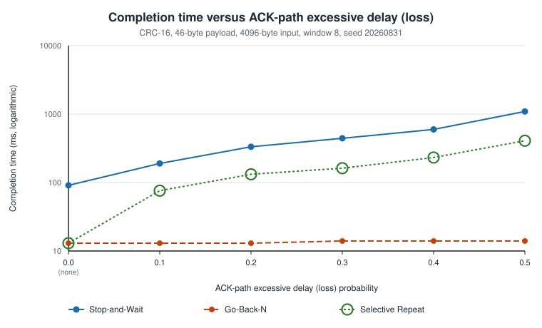

*Completion time versus ACK-path excessive delay (loss). Source: [`completion_ms_vs_probability_ack-delay.svg`](../results/plots/completion_ms_vs_probability_ack-delay.svg).*

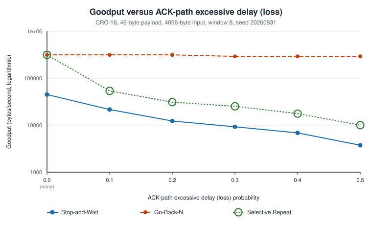

*Goodput versus ACK-path excessive delay (loss). Source: [`goodput_bytes_per_second_vs_probability_ack-delay.svg`](../results/plots/goodput_bytes_per_second_vs_probability_ack-delay.svg).*

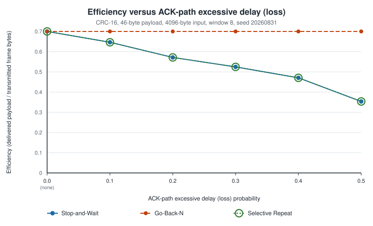

*Efficiency versus ACK-path excessive delay (loss). Source: [`efficiency_vs_probability_ack-delay.svg`](../results/plots/efficiency_vs_probability_ack-delay.svg).*

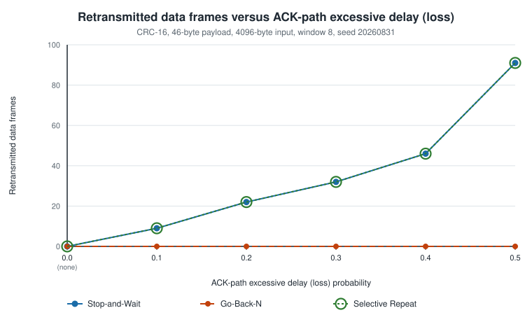

*Retransmitted data frames versus ACK-path excessive delay (loss). Source: [`retransmissions_vs_probability_ack-delay.svg`](../results/plots/retransmissions_vs_probability_ack-delay.svg).*

### 4.3 What the numbers show

**DATA-path bit corruption.**

At the hardest level tested, probability 0.5:

| Protocol | Completion (ms) | Goodput (B/s) | Efficiency | Retransmissions | Timeouts |
| --- | --- | --- | --- | --- | --- |
| Stop-and-Wait | 1309 | 3,129 | 0.380952 | 78 | 78 |
| Go-Back-N | 10556 | 388 | 0.072810 | 789 | 104 |
| Selective Repeat | 328 | 12,488 | 0.380952 | 78 | 26 |

Note: for `go-back-n__data-error__0.5`, the timeout estimator was still at its 100 ms constructor default throughout the run above -- Karn's rule discarded every RTT sample, so the estimator never adapted -- and every timeout round in the completion time and goodput above cost 100 ms of logical clock rather than a fitted value (§3.4, §3.5).

Selective Repeat finishes fastest (328 ms, 25.2x the unimpaired baseline), and Stop-and-Wait and Selective Repeat reach the highest efficiency (0.380952).
Stop-and-Wait and Selective Repeat produce *identical* `efficiency` at every level on this path, so their curves coincide exactly in that figure (see §4.2 for how coincident series stay distinguishable there).
Stop-and-Wait and Selective Repeat produce *identical* `retransmissions` at every level on this path, so their curves coincide exactly in that figure (see §4.2 for how coincident series stay distinguishable there).

**DATA-path excessive delay (loss).**

At the hardest level tested, probability 0.5:

| Protocol | Completion (ms) | Goodput (B/s) | Efficiency | Retransmissions | Timeouts |
| --- | --- | --- | --- | --- | --- |
| Stop-and-Wait | 1309 | 3,129 | 0.380952 | 78 | 78 |
| Go-Back-N | 10556 | 388 | 0.072810 | 789 | 104 |
| Selective Repeat | 328 | 12,488 | 0.380952 | 78 | 26 |

Note: for `go-back-n__data-delay__0.5`, the timeout estimator was still at its 100 ms constructor default throughout the run above -- Karn's rule discarded every RTT sample, so the estimator never adapted -- and every timeout round in the completion time and goodput above cost 100 ms of logical clock rather than a fitted value (§3.4, §3.5).

Selective Repeat finishes fastest (328 ms, 25.2x the unimpaired baseline), and Stop-and-Wait and Selective Repeat reach the highest efficiency (0.380952).
Stop-and-Wait and Selective Repeat produce *identical* `efficiency` at every level on this path, so their curves coincide exactly in that figure (see §4.2 for how coincident series stay distinguishable there).
Stop-and-Wait and Selective Repeat produce *identical* `retransmissions` at every level on this path, so their curves coincide exactly in that figure (see §4.2 for how coincident series stay distinguishable there).

**ACK-path bit corruption.**

At the hardest level tested, probability 0.5:

| Protocol | Completion (ms) | Goodput (B/s) | Efficiency | Retransmissions | Timeouts |
| --- | --- | --- | --- | --- | --- |
| Stop-and-Wait | 1092 | 3,751 | 0.353591 | 91 | 91 |
| Go-Back-N | 14 | 292,571 | 0.711111 | 0 | 0 |
| Selective Repeat | 408 | 10,039 | 0.353591 | 91 | 33 |

Go-Back-N finishes fastest (14 ms, 1.1x the unimpaired baseline), and Go-Back-N reaches the highest efficiency (0.711111).
Stop-and-Wait and Selective Repeat produce *identical* `efficiency` at every level on this path, so their curves coincide exactly in that figure (see §4.2 for how coincident series stay distinguishable there).
Stop-and-Wait and Selective Repeat produce *identical* `retransmissions` at every level on this path, so their curves coincide exactly in that figure (see §4.2 for how coincident series stay distinguishable there).
Go-Back-N never retransmits on this path at any level tested.

**ACK-path excessive delay (loss).**

At the hardest level tested, probability 0.5:

| Protocol | Completion (ms) | Goodput (B/s) | Efficiency | Retransmissions | Timeouts |
| --- | --- | --- | --- | --- | --- |
| Stop-and-Wait | 1092 | 3,751 | 0.353591 | 91 | 91 |
| Go-Back-N | 14 | 292,571 | 0.711111 | 0 | 0 |
| Selective Repeat | 408 | 10,039 | 0.353591 | 91 | 33 |

Go-Back-N finishes fastest (14 ms, 1.1x the unimpaired baseline), and Go-Back-N reaches the highest efficiency (0.711111).
Stop-and-Wait and Selective Repeat produce *identical* `efficiency` at every level on this path, so their curves coincide exactly in that figure (see §4.2 for how coincident series stay distinguishable there).
Stop-and-Wait and Selective Repeat produce *identical* `retransmissions` at every level on this path, so their curves coincide exactly in that figure (see §4.2 for how coincident series stay distinguishable there).
Go-Back-N never retransmits on this path at any level tested.

**Reading the comparison as a whole.**

Impairment on the DATA path and impairment on the ACK path are not symmetric, and the asymmetry follows directly from how each protocol acknowledges. Go-Back-N's acknowledgments are cumulative, so a later acknowledgment subsumes every earlier one it passes: with a window of frames acknowledged per round, losing individual acknowledgments costs it zero retransmissions at every level tested in this result set. Stop-and-Wait has exactly one acknowledgment in flight and Selective Repeat needs each frame acknowledged individually, so both must recover from every acknowledgment that is corrupted or delayed.

On the DATA path the ordering reverses. Go-Back-N's whole-window retransmission turns each lost frame into a burst of resends, and the cost compounds as the probability rises, while Selective Repeat retransmits only what was actually missed, matching Stop-and-Wait's retransmission count exactly at every level tested in this result set, at a fraction of its completion time.

**2 pair(s) of impairment sweeps coincide exactly.** The following pairs agree on every metric, for every protocol, at every probability level (all 15 row pairs each), which means the 4 figures for one path are duplicates of the 4 for the other:

- `data-error` and `data-delay` — DATA-path bit corruption and DATA-path excessive delay (loss). The receiver discards a DATA frame that fails its FCS check without acknowledging it, which is exactly what it does with a frame that never arrived, and the sender counts a frame's wire bytes when it transmits the frame, before the channel decides its fate. A corrupted DATA frame and an excessively delayed one are therefore indistinguishable in every metric the sender records.
- `ack-error` and `ack-delay` — ACK-path bit corruption and ACK-path excessive delay (loss). The sender rejects an acknowledgment whose body fails its complement check and discards it, which is exactly what happens to an acknowledgment that never arrived: the window does not move either way, and the round is a timeout either way. A corrupted acknowledgment and an excessively delayed one are therefore indistinguishable in every metric the sender records.

This is expected rather than a defect, and it has a second cause on top of the mechanisms above. The channel draws from one pseudo-random stream per path and consumes no draw at all for a probability of exactly 0.0, so in this one-factor-at-a-time design the swept dimension is the only one drawing. Two sweeps of the same path at the same probability therefore land on exactly the same transmissions, and not merely on a statistically similar number of them. That makes the comparison maximally fair, at the cost of the two sweeps carrying no independent information.

## 5. Reproducing this report

```bash
make -C C++ all           # build build/sender and build/receiver
make -C C++ test          # unit, end-to-end, and tooling tests
make -C C++ experiments   # regenerate results/experiments.csv
make -C C++ results       # validate, plot, and re-render this report
```

The fixture itself is regenerated with:

```bash
uv run python C++/tools/generate_test_data.py \
    --output C++/test_data/input.bin --seed 20260831 --size 4096
```

Every run is pinned to one seed and the tools are deterministic, so re-running
the pipeline on the same binaries reproduces this report byte for byte.

## 6. Complete result set

Every run in [`../results/experiments.csv`](../results/experiments.csv):

#### Stop-and-Wait

| run id | impairment | probability | completion ms | goodput bytes per second | efficiency | original transmissions | retransmissions | acks | timeouts | duplicates | out of order | mean rtt ms | current timeout ms |
| --- | --- | --- | --- | --- | --- | --- | --- | --- | --- | --- | --- | --- | --- |
| stop-and-wait__none | none | 0.0 | 91 | 45010.989011 | 0.711111 | 90 | 0 | 90 | 0 | 0 | 0 | 1.000000 | 10 |
| stop-and-wait__data-error__0.1 | data-error | 0.1 | 201 | 20378.109453 | 0.640000 | 90 | 10 | 90 | 10 | 0 | 0 | 1.000000 | 10 |
| stop-and-wait__data-error__0.2 | data-error | 0.2 | 344 | 11906.976744 | 0.566372 | 90 | 23 | 90 | 23 | 0 | 0 | 1.000000 | 10 |
| stop-and-wait__data-error__0.3 | data-error | 0.3 | 575 | 7123.478261 | 0.477612 | 90 | 44 | 90 | 44 | 0 | 0 | 1.000000 | 10 |
| stop-and-wait__data-error__0.4 | data-error | 0.4 | 852 | 4807.511737 | 0.423841 | 90 | 61 | 90 | 61 | 0 | 0 | 1.000000 | 10 |
| stop-and-wait__data-error__0.5 | data-error | 0.5 | 1309 | 3129.106188 | 0.380952 | 90 | 78 | 90 | 78 | 0 | 0 | 1.000000 | 10 |
| stop-and-wait__data-delay__0.1 | data-delay | 0.1 | 201 | 20378.109453 | 0.640000 | 90 | 10 | 90 | 10 | 0 | 0 | 1.000000 | 10 |
| stop-and-wait__data-delay__0.2 | data-delay | 0.2 | 344 | 11906.976744 | 0.566372 | 90 | 23 | 90 | 23 | 0 | 0 | 1.000000 | 10 |
| stop-and-wait__data-delay__0.3 | data-delay | 0.3 | 575 | 7123.478261 | 0.477612 | 90 | 44 | 90 | 44 | 0 | 0 | 1.000000 | 10 |
| stop-and-wait__data-delay__0.4 | data-delay | 0.4 | 852 | 4807.511737 | 0.423841 | 90 | 61 | 90 | 61 | 0 | 0 | 1.000000 | 10 |
| stop-and-wait__data-delay__0.5 | data-delay | 0.5 | 1309 | 3129.106188 | 0.380952 | 90 | 78 | 90 | 78 | 0 | 0 | 1.000000 | 10 |
| stop-and-wait__ack-error__0.1 | ack-error | 0.1 | 190 | 21557.894737 | 0.646465 | 90 | 9 | 90 | 9 | 0 | 0 | 1.000000 | 10 |
| stop-and-wait__ack-error__0.2 | ack-error | 0.2 | 333 | 12300.300300 | 0.571429 | 90 | 22 | 90 | 22 | 0 | 0 | 1.000000 | 10 |
| stop-and-wait__ack-error__0.3 | ack-error | 0.3 | 443 | 9246.049661 | 0.524590 | 90 | 32 | 90 | 32 | 0 | 0 | 1.000000 | 10 |
| stop-and-wait__ack-error__0.4 | ack-error | 0.4 | 597 | 6860.971524 | 0.470588 | 90 | 46 | 90 | 46 | 0 | 0 | 1.000000 | 10 |
| stop-and-wait__ack-error__0.5 | ack-error | 0.5 | 1092 | 3750.915751 | 0.353591 | 90 | 91 | 90 | 91 | 0 | 0 | 1.000000 | 10 |
| stop-and-wait__ack-delay__0.1 | ack-delay | 0.1 | 190 | 21557.894737 | 0.646465 | 90 | 9 | 90 | 9 | 0 | 0 | 1.000000 | 10 |
| stop-and-wait__ack-delay__0.2 | ack-delay | 0.2 | 333 | 12300.300300 | 0.571429 | 90 | 22 | 90 | 22 | 0 | 0 | 1.000000 | 10 |
| stop-and-wait__ack-delay__0.3 | ack-delay | 0.3 | 443 | 9246.049661 | 0.524590 | 90 | 32 | 90 | 32 | 0 | 0 | 1.000000 | 10 |
| stop-and-wait__ack-delay__0.4 | ack-delay | 0.4 | 597 | 6860.971524 | 0.470588 | 90 | 46 | 90 | 46 | 0 | 0 | 1.000000 | 10 |
| stop-and-wait__ack-delay__0.5 | ack-delay | 0.5 | 1092 | 3750.915751 | 0.353591 | 90 | 91 | 90 | 91 | 0 | 0 | 1.000000 | 10 |

#### Go-Back-N

| run id | impairment | probability | completion ms | goodput bytes per second | efficiency | original transmissions | retransmissions | acks | timeouts | duplicates | out of order | mean rtt ms | current timeout ms |
| --- | --- | --- | --- | --- | --- | --- | --- | --- | --- | --- | --- | --- | --- |
| go-back-n__none | none | 0.0 | 13 | 315076.923077 | 0.711111 | 90 | 0 | 90 | 0 | 0 | 0 | 1.000000 | 10 |
| go-back-n__data-error__0.1 | data-error | 0.1 | 117 | 35008.547009 | 0.395062 | 90 | 72 | 149 | 9 | 59 | 0 | 1.000000 | 10 |
| go-back-n__data-error__0.2 | data-error | 0.2 | 241 | 16995.850622 | 0.270042 | 90 | 147 | 187 | 20 | 97 | 0 | 1.000000 | 10 |
| go-back-n__data-error__0.3 | data-error | 0.3 | 609 | 6725.779967 | 0.131687 | 90 | 396 | 325 | 52 | 235 | 0 | 1.000000 | 10 |
| go-back-n__data-error__0.4 | data-error | 0.4 | 7720 | 530.569948 | 0.096241 | 90 | 575 | 386 | 76 | 296 | 0 | 0.000000 | 100 |
| go-back-n__data-error__0.5 | data-error | 0.5 | 10556 | 388.025767 | 0.072810 | 90 | 789 | 413 | 104 | 323 | 0 | 0.000000 | 100 |
| go-back-n__data-delay__0.1 | data-delay | 0.1 | 117 | 35008.547009 | 0.395062 | 90 | 72 | 149 | 9 | 59 | 0 | 1.000000 | 10 |
| go-back-n__data-delay__0.2 | data-delay | 0.2 | 241 | 16995.850622 | 0.270042 | 90 | 147 | 187 | 20 | 97 | 0 | 1.000000 | 10 |
| go-back-n__data-delay__0.3 | data-delay | 0.3 | 609 | 6725.779967 | 0.131687 | 90 | 396 | 325 | 52 | 235 | 0 | 1.000000 | 10 |
| go-back-n__data-delay__0.4 | data-delay | 0.4 | 7720 | 530.569948 | 0.096241 | 90 | 575 | 386 | 76 | 296 | 0 | 0.000000 | 100 |
| go-back-n__data-delay__0.5 | data-delay | 0.5 | 10556 | 388.025767 | 0.072810 | 90 | 789 | 413 | 104 | 323 | 0 | 0.000000 | 100 |
| go-back-n__ack-error__0.1 | ack-error | 0.1 | 13 | 315076.923077 | 0.711111 | 90 | 0 | 81 | 0 | 0 | 7 | 1.000000 | 10 |
| go-back-n__ack-error__0.2 | ack-error | 0.2 | 13 | 315076.923077 | 0.711111 | 90 | 0 | 73 | 0 | 0 | 10 | 1.000000 | 10 |
| go-back-n__ack-error__0.3 | ack-error | 0.3 | 14 | 292571.428571 | 0.711111 | 90 | 0 | 66 | 0 | 0 | 17 | 1.000000 | 10 |
| go-back-n__ack-error__0.4 | ack-error | 0.4 | 14 | 292571.428571 | 0.711111 | 90 | 0 | 59 | 0 | 0 | 22 | 1.000000 | 10 |
| go-back-n__ack-error__0.5 | ack-error | 0.5 | 14 | 292571.428571 | 0.711111 | 90 | 0 | 49 | 0 | 0 | 23 | 1.000000 | 10 |
| go-back-n__ack-delay__0.1 | ack-delay | 0.1 | 13 | 315076.923077 | 0.711111 | 90 | 0 | 81 | 0 | 0 | 7 | 1.000000 | 10 |
| go-back-n__ack-delay__0.2 | ack-delay | 0.2 | 13 | 315076.923077 | 0.711111 | 90 | 0 | 73 | 0 | 0 | 10 | 1.000000 | 10 |
| go-back-n__ack-delay__0.3 | ack-delay | 0.3 | 14 | 292571.428571 | 0.711111 | 90 | 0 | 66 | 0 | 0 | 17 | 1.000000 | 10 |
| go-back-n__ack-delay__0.4 | ack-delay | 0.4 | 14 | 292571.428571 | 0.711111 | 90 | 0 | 59 | 0 | 0 | 22 | 1.000000 | 10 |
| go-back-n__ack-delay__0.5 | ack-delay | 0.5 | 14 | 292571.428571 | 0.711111 | 90 | 0 | 49 | 0 | 0 | 23 | 1.000000 | 10 |

#### Selective Repeat

| run id | impairment | probability | completion ms | goodput bytes per second | efficiency | original transmissions | retransmissions | acks | timeouts | duplicates | out of order | mean rtt ms | current timeout ms |
| --- | --- | --- | --- | --- | --- | --- | --- | --- | --- | --- | --- | --- | --- |
| selective-repeat__none | none | 0.0 | 13 | 315076.923077 | 0.711111 | 90 | 0 | 90 | 0 | 0 | 0 | 1.000000 | 10 |
| selective-repeat__data-error__0.1 | data-error | 0.1 | 98 | 41795.918367 | 0.640000 | 90 | 10 | 90 | 7 | 0 | 43 | 1.000000 | 10 |
| selective-repeat__data-error__0.2 | data-error | 0.2 | 147 | 27863.945578 | 0.566372 | 90 | 23 | 90 | 11 | 0 | 37 | 1.000000 | 10 |
| selective-repeat__data-error__0.3 | data-error | 0.3 | 233 | 17579.399142 | 0.477612 | 90 | 44 | 90 | 18 | 0 | 54 | 1.000000 | 10 |
| selective-repeat__data-error__0.4 | data-error | 0.4 | 254 | 16125.984252 | 0.423841 | 90 | 61 | 90 | 20 | 0 | 53 | 1.000000 | 10 |
| selective-repeat__data-error__0.5 | data-error | 0.5 | 328 | 12487.804878 | 0.380952 | 90 | 78 | 90 | 26 | 0 | 56 | 1.000000 | 10 |
| selective-repeat__data-delay__0.1 | data-delay | 0.1 | 98 | 41795.918367 | 0.640000 | 90 | 10 | 90 | 7 | 0 | 43 | 1.000000 | 10 |
| selective-repeat__data-delay__0.2 | data-delay | 0.2 | 147 | 27863.945578 | 0.566372 | 90 | 23 | 90 | 11 | 0 | 37 | 1.000000 | 10 |
| selective-repeat__data-delay__0.3 | data-delay | 0.3 | 233 | 17579.399142 | 0.477612 | 90 | 44 | 90 | 18 | 0 | 54 | 1.000000 | 10 |
| selective-repeat__data-delay__0.4 | data-delay | 0.4 | 254 | 16125.984252 | 0.423841 | 90 | 61 | 90 | 20 | 0 | 53 | 1.000000 | 10 |
| selective-repeat__data-delay__0.5 | data-delay | 0.5 | 328 | 12487.804878 | 0.380952 | 90 | 78 | 90 | 26 | 0 | 56 | 1.000000 | 10 |
| selective-repeat__ack-error__0.1 | ack-error | 0.1 | 76 | 53894.736842 | 0.646465 | 90 | 9 | 90 | 5 | 0 | 26 | 1.000000 | 10 |
| selective-repeat__ack-error__0.2 | ack-error | 0.2 | 132 | 31030.303030 | 0.571429 | 90 | 22 | 90 | 10 | 0 | 32 | 1.000000 | 10 |
| selective-repeat__ack-error__0.3 | ack-error | 0.3 | 162 | 25283.950617 | 0.524590 | 90 | 32 | 90 | 12 | 0 | 43 | 1.000000 | 10 |
| selective-repeat__ack-error__0.4 | ack-error | 0.4 | 232 | 17655.172414 | 0.470588 | 90 | 46 | 90 | 18 | 0 | 59 | 1.000000 | 10 |
| selective-repeat__ack-error__0.5 | ack-error | 0.5 | 408 | 10039.215686 | 0.353591 | 90 | 91 | 90 | 33 | 0 | 61 | 1.000000 | 10 |
| selective-repeat__ack-delay__0.1 | ack-delay | 0.1 | 76 | 53894.736842 | 0.646465 | 90 | 9 | 90 | 5 | 0 | 26 | 1.000000 | 10 |
| selective-repeat__ack-delay__0.2 | ack-delay | 0.2 | 132 | 31030.303030 | 0.571429 | 90 | 22 | 90 | 10 | 0 | 32 | 1.000000 | 10 |
| selective-repeat__ack-delay__0.3 | ack-delay | 0.3 | 162 | 25283.950617 | 0.524590 | 90 | 32 | 90 | 12 | 0 | 43 | 1.000000 | 10 |
| selective-repeat__ack-delay__0.4 | ack-delay | 0.4 | 232 | 17655.172414 | 0.470588 | 90 | 46 | 90 | 18 | 0 | 59 | 1.000000 | 10 |
| selective-repeat__ack-delay__0.5 | ack-delay | 0.5 | 408 | 10039.215686 | 0.353591 | 90 | 91 | 90 | 33 | 0 | 61 | 1.000000 | 10 |
