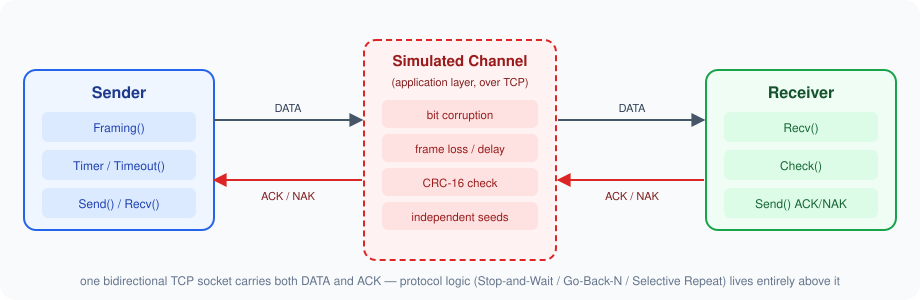

# CN-Flow-Control

[](C++-basic/)
[](C++-basic/Makefile)
[](#repository-layout)
[](pyproject.toml)
[](LICENSE)

A Computer Networks course assignment implementing **Data Link Layer flow control over TCP**. A sender and a receiver exchange a file through a single TCP socket while three classic Automatic Repeat reQuest (ARQ) protocols are implemented and compared:

| Protocol | Window | Retransmission on loss/timeout |
| --- | --- | --- |
| **Stop-and-Wait** | 1 | resend the one outstanding frame |
| **Go-Back-N** | *N* | resend the entire outstanding window |
| **Selective Repeat** | *N* | resend only the missing/timed-out frame |

TCP only carries the bytes — everything the assignment actually asks for is simulated at the application layer on top of it: frame **framing**, **CRC-16 error detection**, **bit corruption**, and **packet loss / excessive delay**, independently on both the DATA and ACK paths.

> Based on `Assignment-2-CO2-FlowControl.pdf` (included in this repo).

## Repository layout

| Path | Contents |
| --- | --- |
| [`C++-basic/`](C++-basic/) | The implementation: C++17 sender/receiver, all three ARQ protocols, an automated experiment matrix, plots, and a generated PDF report. |
| [`Assignment-2-CO2-FlowControl.pdf`](Assignment-2-CO2-FlowControl.pdf) | The assignment brief. |
| [`pyproject.toml`](pyproject.toml), [`uv.lock`](uv.lock) | Root `uv`-managed Python environment used by `C++-basic/tools/` (experiment runner, plotting, report generation). |
| [`LICENSE`](LICENSE) | MIT license. |

## Quick start

```bash
make -C C++-basic all           # strict C++17 build -> C++-basic/build/{sender,receiver}
make -C C++-basic experiments   # run the reproducible impairment-sweep experiment matrix
make -C C++-basic results       # experiments + SVG plots + LaTeX/PDF report
```

Or try it interactively without touching any flags:

```bash
./C++-basic/run_demo.sh   # builds, then walks you through protocol/window/impairment/file
```

See [`C++-basic/README.md`](C++-basic/README.md) for the full wire format, protocol behavior, CLI flags, and every build/test/experiment target.

## How it works, in one picture



Each protocol layer (`stop_and_wait`, `go_back_n`, `selective_repeat`) is built from the same small set of shared modules — frame layout, CRC-16, channel impairment injection, socket I/O, and an RTT-adaptive timer — so the three implementations differ only in *windowing and retransmission policy*, which is exactly what the assignment asks you to compare.

## Documentation

- [`C++-basic/README.md`](C++-basic/README.md) — wire format, CLI flags, build/test/experiment commands, and known simplifications.
- [`C++-basic/explanation.md`](C++-basic/explanation.md) — a complete, no-assumptions walkthrough of every piece of the project, from "what is a socket" up through why Selective Repeat needs a map instead of an array.
- [`C++-basic/report/report.tex`](C++-basic/report/report.tex) — the LaTeX source for the generated experiment report (`make -C C++-basic report` renders `report/report.pdf`).

## License

MIT — see [`LICENSE`](LICENSE).
